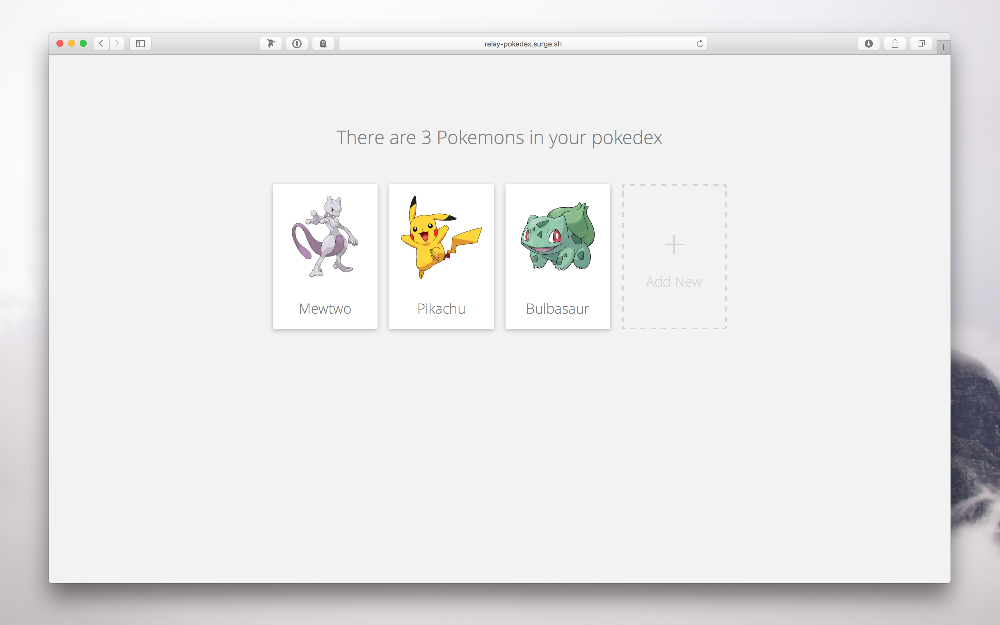

<iframe height="315" src="https://www.youtube.com/embed/EQcUmSEkr2Q" frameborder="0" allowfullscreen></iframe>

# Brief introduction

If you have heard about Relay.js but are not sure of what it really is, how it is useful, or how to start your first Relay application, you have come to the right place!

Welcome to **Learn Relay**, a comprehensive introduction to Relay.js. In this tutorial, we'll take you step by step through the fundamental concepts of Relay. By understanding the concepts underlying Relay through practical examples, we hope that by the end of this tutorial you will have enough knowledge to create your own Relay applications.

Each chapter will start with a short video that will give you a brief overview, followed by a more complete explanation of the Relay concept and what this concept looks like in practice. Let's get started!

## Goals

- Understand what Relay is and what its value proposition is
- Understand how Relay is related to Flux
- Be aware of benefits and drawbacks of Relay
- Deeply understand fundamental concepts of Relay
- Learn how to build a realistic Relay application
- Access Relay resources and join community to further learn

## Pokedex application

Let's talk about our first Relay application. You might have seen a lot of Todo List applications before so let's try something new! In this tutorial we will build a Pokedex application where you can browse and modify your existing Pokemons or add new ones. See for yourself in [this online demo](http://demo.learnrelay.org).
